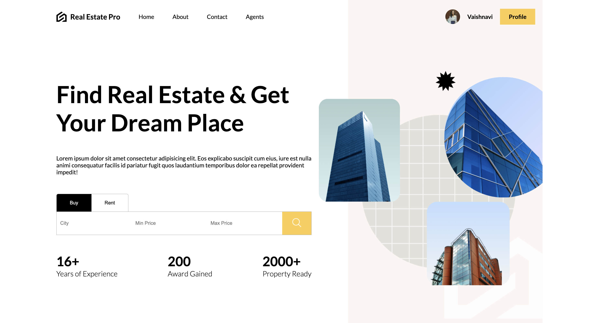
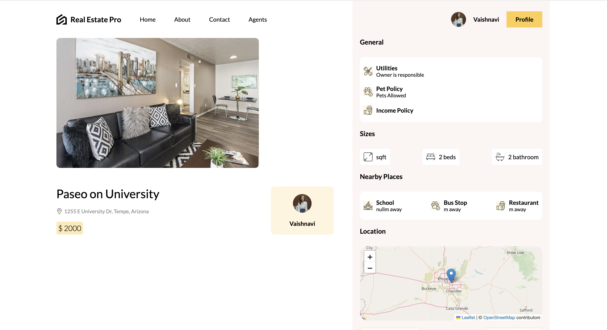
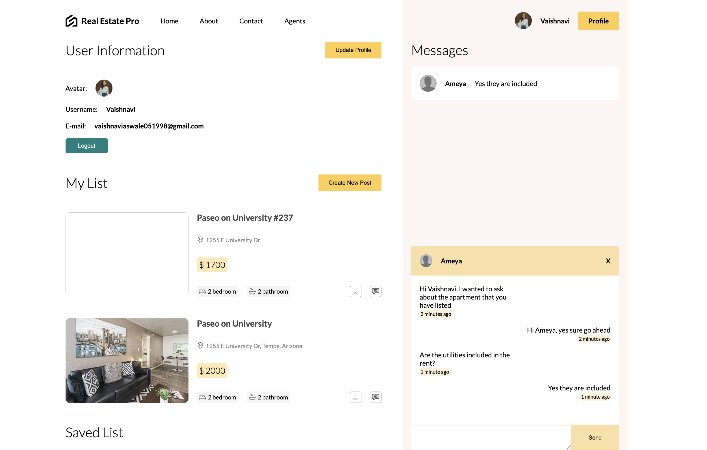

# Real Estate Pro 🏠

A modern real estate platform built with the MERN stack (MongoDB, Express.js, React.js, Node.js) that allows users to browse, list, and interact with real estate properties.

## Features ✨

- **Property Listings** 📋
  - Browse properties with detailed information
  - Filter by city, property type, price range, and number of bedrooms
  - View property locations on an interactive map
  - Detailed property pages with image galleries

- **User Authentication** 🔐
  - Secure user registration and login
  - JWT-based authentication
  - Profile management

- **Property Management** 🏘️
  - Create new property listings
  - Upload multiple images
  - Add detailed property information
  - Manage your listings

- **Interactive Features** 💫
  - Save favorite properties
  - Real-time chat with property owners
  - View property locations on interactive maps
  - Image galleries for each property

- **Search & Filter** 🔍
  - Advanced property search
  - Filter by multiple criteria
  - Price range selection
  - Location-based search

## Tech Stack 🛠️

### Frontend
- React.js
- SCSS for styling
- React Router for navigation
- Axios for API requests
- Cloudinary for image uploads
- OpenStreetMap for mapping

### Backend
- Node.js
- Express.js
- MongoDB with Prisma ORM
- JWT for authentication
- Socket.io for real-time chat

## Getting Started 🚀

### Prerequisites
- Node.js (v14 or higher)
- MongoDB
- npm or yarn

### Installation

1. Clone the repository
```bash
git clone https://github.com/Vaishnavi-Aswale/real-estate-pro.git
cd real-estate-pro
```

2. Install dependencies for both frontend and backend
```bash
# Install API dependencies
cd api
npm install

# Install Client dependencies
cd ../client
npm install

# Install Socket dependencies
cd ../socket
npm install
```

3. Set up environment variables

Create `.env` files in the api directory:
```env
DATABASE_URL="your_mongodb_url"
JWT_SECRET_KEY="your_jwt_secret"
```

4. Start the development servers

```bash
# Start API server (from api directory)
npm start

# Start Client development server (from client directory)
npm run dev

# Start Socket server (from socket directory)
npm start
```

## Project Structure 📁

```
real-estate-pro/
├── api/                 # Backend API
│   ├── controllers/     # Route controllers
│   ├── routes/         # API routes
│   ├── lib/            # Shared utilities
│   └── prisma/         # Database schema and migrations
├── client/             # Frontend React application
│   ├── src/
│   │   ├── components/ # Reusable components
│   │   ├── context/    # React context
│   │   ├── lib/        # Utilities and helpers
│   │   └── routes/     # Page components
└── socket/             # Real-time chat server
```

## API Endpoints 🛣️

### Authentication
- `POST /api/auth/register` - Register new user
- `POST /api/auth/login` - User login
- `POST /api/auth/logout` - User logout

### Properties
- `GET /api/posts` - Get all properties
- `GET /api/posts/:id` - Get single property
- `POST /api/posts` - Create new property
- `DELETE /api/posts/:id` - Delete property

### User
- `GET /api/users/profilePosts` - Get user's posts
- `POST /api/users/save` - Save property
- `GET /api/users/notification` - Get user notifications

### Chat
- `GET /api/chats` - Get user's chats
- `GET /api/chats/:id` - Get single chat
- `POST /api/chats` - Create new chat


## Acknowledgments 

- OpenStreetMap for mapping functionality
- Cloudinary for image hosting
- All the amazing open-source packages that made this project possible

## Screenshots

### Home Page


### Profile Section


### Chat Section

